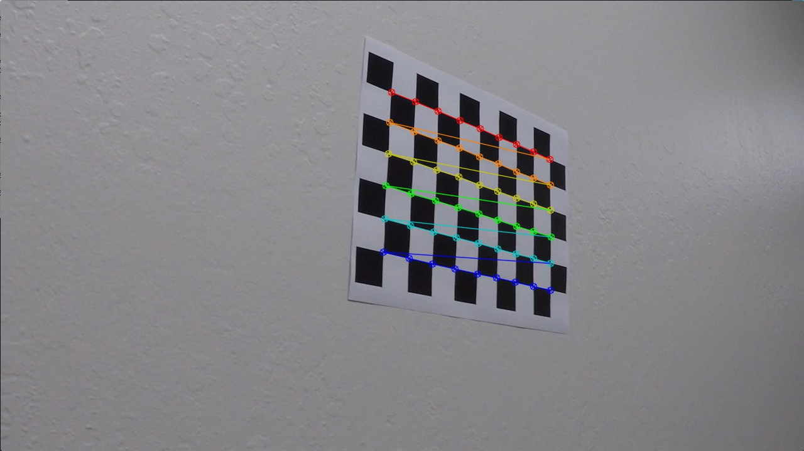
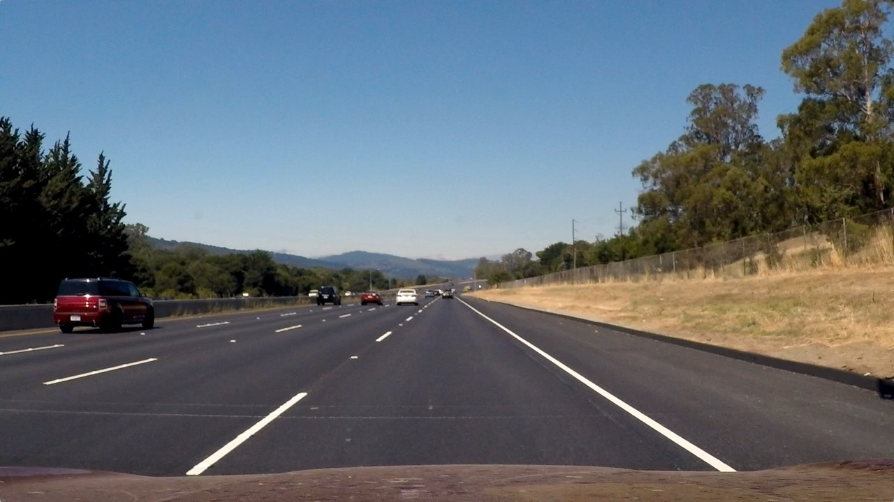
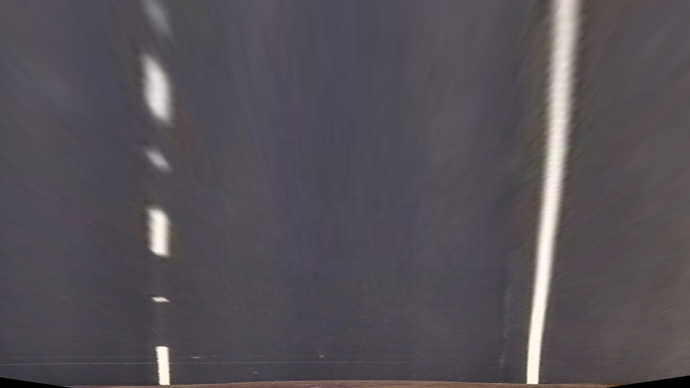
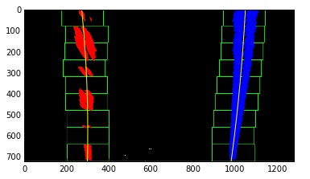

##Project 4: Advanced Labe Line Detection

---

Here I explain how I approach this problem using the tips mentioned in the course.

The goals / steps of this project are the following:

* Compute the camera calibration matrix and distortion coefficients given a set of chessboard images.
* Apply a distortion correction to raw images.
* Use color transforms, gradients, etc., to create a thresholded binary image.
* Apply a perspective transform to rectify binary image ("birds-eye view").
* Detect lane pixels and fit to find the lane boundary.
* Determine the curvature of the lane and vehicle position with respect to center.
* Warp the detected lane boundaries back onto the original image.
* Output visual display of the lane boundaries and numerical estimation of lane curvature and vehicle position.


## [Rubric](https://review.udacity.com/#!/rubrics/571/view) Points
###Here I will consider the rubric points individually and describe how I addressed each point in my implementation.  

---
###Writeup / README

####1. Provide a Writeup / README that includes all the rubric points and how you addressed each one.  You can submit your writeup as markdown or pdf.  [Here](https://github.com/udacity/CarND-Advanced-Lane-Lines/blob/master/writeup_template.md) is a template writeup for this project you can use as a guide and a starting point.  

You're reading it! :-)

###Camera Calibration

####1. Briefly state how you computed the camera matrix and distortion coefficients. Provide an example of a distortion corrected calibration image.

The code for this step is contained in lines `20` through  `90`of the file called `main.py`).  

I start by preparing "object points", which will be the (x, y, z) coordinates of the chessboard corners in the world. Here I am assuming the chessboard is fixed on the (x, y) plane at z=0, such that the object points are the same for each calibration image.  Thus, `objp` is just a replicated array of coordinates, and `objpoints` will be appended with a copy of it every time I successfully detect all chessboard corners in a test image.  `imgpoints` will be appended with the (x, y) pixel position of each of the corners in the image plane with each successful chessboard detection.  

I then used the output `objpoints` and `imgpoints` to compute the camera calibration and distortion coefficients using the `cv2.calibrateCamera()` function.  I applied this distortion correction to the test image using the `cv2.undistort()` function and obtained this result: 


Corner detection:

 

Distorted image:

 


Undistorted image:

 


###Pipeline (single images)

####1. Describe how (and identify where in your code) you used color transforms, gradients or other methods to create a thresholded binary image.  Provide an example of a binary image result.

I used a combination of color and gradient thresholds to generate a binary image (thresholding steps at lines `36` through `63` in `myUtils.py`).  I used `s_thresh=(170, 255)` and `sx_thresh=(30, 255)` to set the minimum and maximum threshod for the color (`S` channel in `HLS`) and Sobel filters, respectively.

Here's an example of my output for this step.  

Original image after distortion correction:

 

Color binary image after applying threshold:

 

Combined thresholded image:

 


####3. Describe how (and identify where in your code) you performed a perspective transform and provide an example of a transformed image.

The code for my perspective transform includes a function called `warper()`, which appears in lines `94` through `163` in the file `main.py`.  The `warper()` function takes as inputs an image (`img`), as well as source (`src`) and destination (`dst`) points.  I use a mouse callback funtion to be able to click on the source image and choose four points. After getting points, I hardcoded the source and destination points in the following manner:

```
offset = 300
src_points = np.float32([[212, 720], [1100, 720], [722, 477], [558, 477]])
dst_points = np.float32([[offset, 720], [1280 - offset, 720], [1280-offset, 400], [offset, 400]])
```
This resulted in the following source and destination points:

| Source        | Destination   | 
|:-------------:|:-------------:| 
| 212, 720      | 300, 720      | 
| 1100, 720     | 980, 720      |
| 722, 477      | 980, 400      |
| 558, 477      | 300, 400      |

I verified that my perspective transform was working as expected by drawing the `src` and `dst` points onto a test image and its warped counterpart to verify that the lines appear parallel in the warped image.


Transformed image:

 


####4. Describe how (and identify where in your code) you identified lane-line pixels and fit their positions with a polynomial?

After thresholding and applying the persective transformation, I calculated the histogram of `1` pixels for each column of the image and localized left and right lines by finding the the top two peaks in the histogram:

 


Then I applied the sliding window technique to find the lines and and fit my lane lines with a 2nd order polynomial kinda like this:

 


####5. Describe how (and identify where in your code) you calculated the radius of curvature of the lane and the position of the vehicle with respect to center.

I did this in lines `164` through `173` in my code in `myUtils.py`

####6. Provide an example image of your result plotted back down onto the road such that the lane area is identified clearly.

I implemented this step in lines `200` through `204` in my code in `main.py`.  Here is an example of my result on a test image:

 

---

###Pipeline (video)

####1. Provide a link to your final video output.  Your pipeline should perform reasonably well on the entire project video (wobbly lines are ok but no catastrophic failures that would cause the car to drive off the road!).

Here's a [link to my video result](./output_images/project_video_result.mp4)

---

###Discussion

####1. Briefly discuss any problems / issues you faced in your implementation of this project.  Where will your pipeline likely fail?  What could you do to make it more robust?


Generally, any approach based on thresholding is sensitive to parameter tunning and it might not work for other environment/conditions (e.g. very sunny or dark environment).

Also, fitting the poynomial with degree 2 might not be accurate enough as in some conditions (e.g. `harder_challenge_video.mp4`) the curve of the road is better represented by higher polynomial degrees (3 or 4).

In addition, this approach might not work when lane lines are not clear or covered by snow. 


Fitting 

